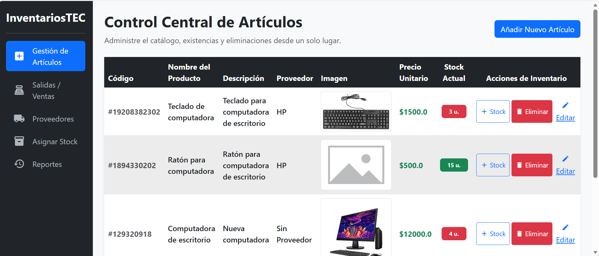
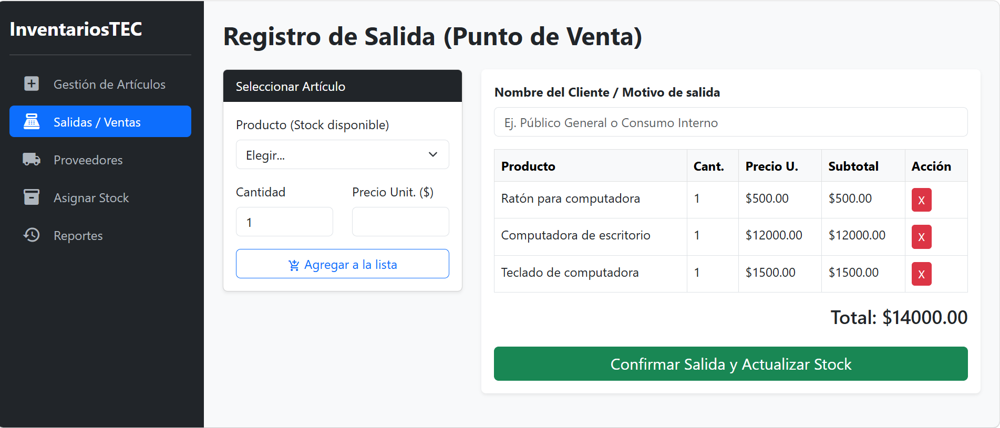
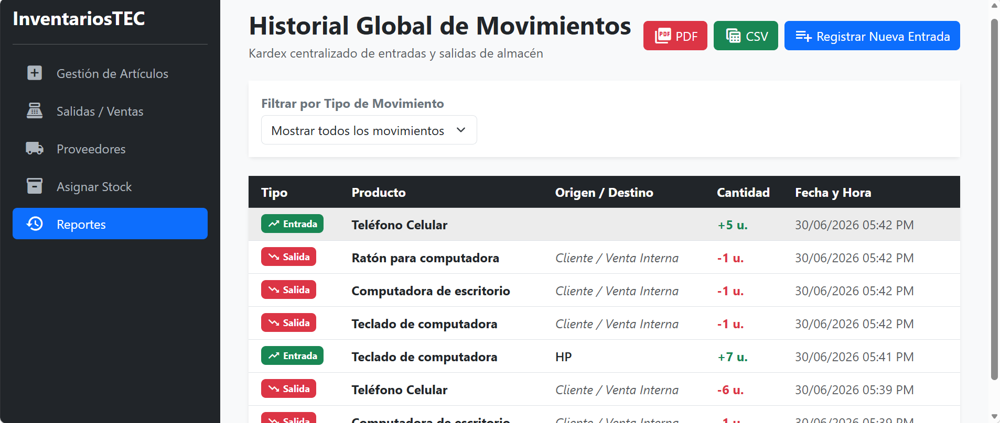

# InventariosTEC 

Sistema web de gestión, control de inventarios, asignación de stock y registro contable de salidas o ventas de mercancía.

<p align="center">
  
</p>

## Tecnologías Utilizadas

* **Lenguaje:** Java (JDK 21)
* **Tecnología Web:** Jakarta EE (Servlets y JSP)
* **Base de Datos:** PostgreSQL
* **Servidor de Aplicaciones:** Apache Tomcat 10.1.55
* **Diseño Interfaz:** Bootstrap 5 & Material Icons
* **Persistencia:** JDBC nativo

## Características del sistema
* **Historial unificado:** Control en tiempo real de las transacciones hechas
* **Punto de venta integrado:** Carga automática de precios con opcion a editar
* **Reportes:** Posibilidad de descargar reportes en formatos PDF y CSV

<table border="0">
  <tr>
    <td width="50%">
      <p align="center"><b>🛒 Módulo de Punto de Venta (POS)</b></p>
      
    </td>
    <td width="50%">
      <p align="center"><b>📄 Visualización de Reportes </b></p>
      
    </td>
  </tr>
</table>


## Instalación y Configuración Local

Sigue estos pasos para replicar el entorno de desarrollo en tu computadora.

### Prerrequisitos
Asegúrate de tener instalado:
* Eclipse IDE (Enterprise Java and Web Developers edition)
* PostgreSQL (Versión 14 o superior)
* Apache Tomcat 10

### Librerías Requeridas

El proyecto incluye y requiere las siguientes dependencias físicas `.jar` dentro de la carpeta `src/main/webapp/WEB-INF/lib/`:

**`postgresql-42.7.2.jar`**: Driver oficial de JDBC para la conexión de la aplicación con la base de datos PostgreSQL.
**`openpdf-2.0.3.jar`**: Biblioteca para la generación dinámica de los reportes en formato PDF.
**`jakarta.servlet.jsp.jstl-3.0.1.jar` y `jakarta.servlet.jsp.jstl-api-3.0.0.jar`**: Implementación de JSTL para permitir el uso de etiquetas dinámicas (`<c:forEach>`, `<c:if>`, etc.) en los archivos JSP sobre Tomcat

### Clonación del Proyecto
Para clonar el proyecto de github:
- Abre una terminal
- Navega hasta la carpeta donde deseas guardar el proyecto, por ejemplo:
```console
cd C:\Users\TuUsuario\eclipse-workspace
```
- Ejecuta el comando para clonar el repositorio:
```console
git clone https://github.com/Irving326/InventariosTEC.git
```
- Al finalizar, tendrás una carpeta con toda la estructura del proyecto.


### Configuración de la Base de Datos
 - Abre tu gestor de base de datos (pgAdmin) y crea una base de datos llamada `inventariostec`
 - Con la base de datos seleccionada, abre la herramienta de consultas (Query Tool)
 - Abre el archivo "database.sql" en la carpeta db ubicada en la raíz del proyecto e introduce el contenido y ejecutalo 
### Conexión a bases de datos
Abre el archivo DBConnection.java ubicado en el paquete com.inventory.util y actualiza tus credenciales locales de PostgreSQL:

private static final String URL = "jdbc:postgresql://localhost:5432/inventariostec";
private static final String USER = "postgres";
private static final String PASSWORD = "admin";

### Configuración de Apache Tomcat 
Si no tienes aun configurado Apache Tomcat sigue estos pasos:

1. Instalar Apache Tomcat 10 y descomprimir
2. En eclipse ve a la pestaña Servers abréla en: Window -> Show -> View -> Servers
3. Haz clic en el enlace azul: "No servers are available. Click this link to create a new server"
4. Selecciona Apache -> Tomcat v10.1 Server y haz clic en Next
5. En Tomcat installation directory, haz clic en Browse y selecciona la carpeta donde descomprimiste Apache Tomcat
6. Haz clic en Finish


### Despliegue desde eclipse
Abre Eclipse IDE.

1. Ve a File -> New File -> Dynamic web project.
2. Desmarca la casilla "Use default location".
3. Da click en "browse" y selecciona la carpeta raíz de Sistema inventarios y finaliza
4. Haz clic derecho sobre el proyecto -> Run As -> Run on Server.
5. Selecciona tu servidor Apache Tomcat 10 configurado y presiona Finish.


   
